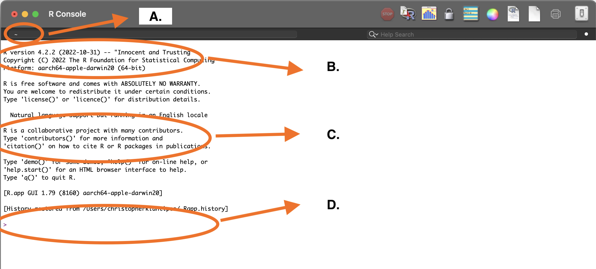
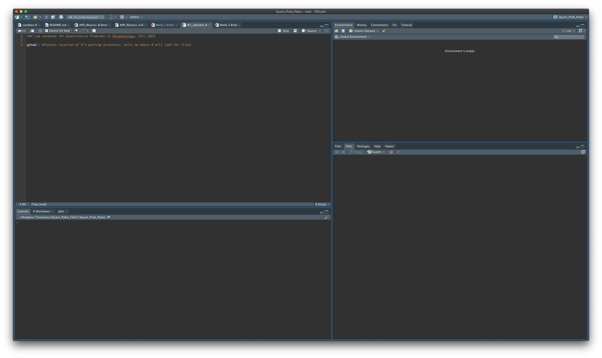
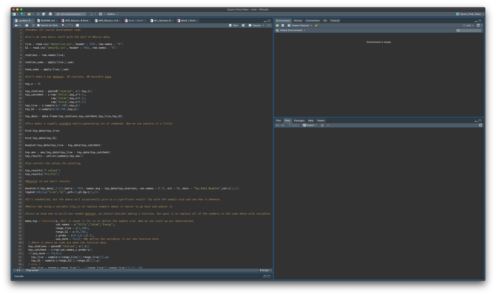

```{r setup, include=FALSE}
knitr::opts_chunk$set(echo = TRUE)
```

## Week 1: Introduction to R, Part I

We will use the R statistical computing environment as a learning tool for this course, with the goal that you will find coding skills and quantitative reasoning to be valuable intellectual assets in the future. Thus, we will develop our skills using computational tools alongside our understanding of how quantitative reasoning is applied within paleoecology.

### Working in R: Troubleshooting Resources

There is a large network of R users from different backgrounds who produce and maintain web-based resources for this platform. There are a number of cheatsheets that summarize important sets of commands and provide examples. Don't be afraid to save these and use them as a quick reference later.

https://iqss.github.io/dss-workshops/R/Rintro/base-r-cheat-sheet.pdf

### Working in R: File Management

In order to access files on your computer, R needs to know where to begin its search. This is your "working directory". Weekly labs are available via canvas or as github repositories that can be checked out. Make sure that R thinks that it is located inside of this folder. Keep in mind that you may successfully open a script or markdown document, but not be able to run it because R does not know where to look for the files which support these scripts.

```{r first things, echo = TRUE}

getwd()

```

### Working in R: Using the console.

The R statistical computing environment operates with only a console window. This text window is where R gives you feedback and where you enter commands. The R Studio wrapper makes working in R easier by combining the console with other windows showing you important information or documents. You can use R or R Studio to follow along. You can copy-paste the code directly into the console, re-type the commands, or create an R script with your notes and code that can be run anytime.

```{r screenshot of R console running solo, echo=FALSE, fig.align = 'center', fig.cap = "**Figure 4.** R Console with annotations for: A, working directory; B,  version; C, citation instructions; and D, the command line."}



```

Note the following:
-the *working directory* is the folder where R looks when it goes to find or write things (Fig. 4:A).
-the software version is at the top of the initialization text, this information is important for citations (Fig. 4:B).
-the intialization text includes instructions for getting information about licensing, help, and for citing R (Fig. 4:C).
-the *command line* is the line starting with ">", which is where you politely ask R to do things for you (Fig. 4:D).

You can do virtually everything you need to do in R with just the console. So long as you kept a .txt file documenting your coding steps, this would be sufficient to conduct many if not all statistical analyses being published currently. However, it is not a very *helpful* platform for coding. 

R Studio is a wrapper for R that allows us to see a bit more of what is going on inside of R and to control it through the window rather than exclusively through the "console". R Studio knows the rules of R syntax, so it will flag errors for you. Much like a spell-checker in word processing, R Studio checks your code for you. More on this later. 

```{r screenshot of blank R Studio, echo=FALSE, fig.align = 'center', fig.cap= "**Figure 6.** R Studio window with annotated console pane: A, working directory; B, R version; C, citation info; and D, the command line."}

knitr::include_graphics("images/R_studio_basic.png")

```

You should have three panes open in the window, as shown in Fig 6. above. The leftmost should look familiar. It is the R console! This is where you'll enter commands to make R do things. It also shows you some of the same information, such as the location of the working directory (Fig 6:A) and command line (Fig 6:D). You may notice other tabs behind the console titled "Terminal" and "Background jobs". Stick with the console for now, but this area of the window is dedicated to what R is *doing*.  

On the right, the top pane also has tabs: "Environment" (Fig 6:E), "History" (Fig 6:F), "Connections" (Fig 6:G), and "Tutorial" (Fig 6:G). We will rely on "Environment" and "History" more than the others for this tutorial. 

The "Environment" allows us to see inside R's brain. Let's take a quick look at how this works by entering the same commands from our first use of base R. You can type these commands manually or copy paste them. 

### Working in R: Annotations and coding principles.

Let's look at an R script which is a basic text document that you can use to track your R code. This is basically a .txt file, but R and R Studio know how to read these with some additional details that make it easier to code. My usual workflow is to develop code within a script, then I use selections of the developed code to create an R markdown document for reporting. We will deal with this later, but the labs are written in R markdown also.

```{r R script image, echo = FALSE, fig.align = 'center', fig.cap = "Figure - R script example"}



```

One reason that so many scientists choose to use command-line coding languages like R for their analyses is because it creates additional transparency for their research projects. Although there is a long way to go in the publishing world, the proliferation of open-access databases, data sets, and techniques for analyzing them promises to improve the reproducibility of our work and shore up the integrity of sceintific inquiry. The problems with the integrity of the academy and scholarly research at large extends beyond the realm of computer code. But for my part I do believe that this approach *does* improve the accessibility of our work and it makes it easier for us to produce consistent and well-documented analytical results. A bonus with R is that it gives us an immense capacity to communicate our results via plotting.

We improve the quality of our work and its reproducibility in the lab by maintaining lab notebooks, which also allows us to diagnose problems and establish effective routines. For quantitative analysis, we take the same approach by maintaining a text file with our code and annotations explaining what the code is supposed to do. The benefit of this approach is making your analyses more consistent and giving you the chance to make systematic improvements to your work through trial and error.

In R, we make annotations using the hash symbol "#".

```{r annotations, echo = TRUE}

#Using the hash symbol lets us enter non-coding text into any document.

```

Here's an example of a developed R script that I created while planning for this course.

```{r developed script, echo = FALSE, fig.align = 'center', fig.cap = "Figure - Example of active R script."}



```


### Working in R: Simple Grammar, Complex Outcomes

#### Objects

One of the reasons that R is appealing to the research community is that it uses a simple and discrete structure to execute complex commands. R only recognizes three different kinds of input: object calls, function calls, and operators (=, <-, etc.). Objects character strings to which we assign some data. When we do this, we tell R that whenever it sees that character string, it should return the contents of the object. We define objects by assigning information to a set of characters. To start, we'll use the "<-" (arrow) operator to assign the value 5 to "x" and the value 6 to "y". In the code chunk below, we define two objects, "x" and "y", giving them the values 5 and 6 respectively. Then, we call the objects by putting their name in the console and hitting <enter>.

```{r defining objects, echo=TRUE}

x <- 5
y <- 6

x
y

```

This can also be achieved by using the equals sign ("="). These symbols are differentiated to make it easier for users to develop custom functions, where it can make sense to differentiate between object and variable assignments. To many R users, this distinction means nothing and their work is not impacted by ignoring "<-".

```{r defining objects alt, echo=TRUE}

x = 5
y = 6

x
y

```

Objects range from simple single digit assignments or character strings to tables, lists, or arrays of data. We will walk before we run, so let's build up the dimensionality of our object. We can make ranges of numbers with ":". Note this can move in either direction.

```{r ranges, echo = TRUE}

x <- 1:100
y <- 100:1

x
y

```

This is a good time to introduce one of R's most important and powerful functions, plot(). All R functions are designed to take some object and perform a task, so they are called by a combination of a character string "plot" and parentheses where objects are called (). On top of this, R's functions also have a number of arguments built into them that allow you to manipulate how the function operates. What is nice about functions is that all arguments have default settings and they are not required in most cases. We can verify this by looking at the help entry for plot with the following.

```{r help, echo = TRUE}

help(plot)

```

Plot is really powerful and we will use it a lot. One advantage to simple plotting is that you can quickly visualize your data, examine it for errors, and look for important patterns. Below, we call the plot function and feed it our objects. R does a lot here, scaling the plot window automatically to the ranges and applying the object names as the labels for the axes. We will work to expand our plotting capacity alongside our quantitative skills in this course and the two will nicely compliment each other. Visualizing our expectations, problems, and data is a key tool for reinforcing and deepening our knowledge.

```{r range plot, echo = TRUE}

plot(x,y)

```

We can also create objects from non-sequential numbers. In order to do so, we will use an essential function within R: concatenate. The function call is "c()", where we take multiple data entries that are delivered in the order listed. In the example below, we assign ten numbers to "x".

```{r concatenate, echo = TRUE}

x = c(9,1,7,3,2,8,4,5,6,10)

x

```

We have been using the object names "x" and "y" here, but we can create any object name we wish so long as we follow some rules. The object name cannot start with numbers or special characters. The object name cannot include spaces or special characters aside from underscores ("_").

There are some basic principles for object naming. We should always give the objects obvious, yet descriptive names. Some of this is learned by experience, but in general I do not use names longer than 10 characters.

```{r object naming, echo = TRUE}

my_numbers = c(9,1,7,3,2,8,4,5,6,10)

numbers_in_order = 1:10 #This is a generally bad object name, with too many characters.

my_numbers
numbers_in_order

plot(my_numbers,numbers_in_order)

mynum = c(9,1,7,3,2,8,4,5,6,10)
ornum = 1:10

plot(mynum, ornum)

```

We see here that objects are more than the data we've stored in them. They include the order of the data as well as the object name. This information shapes the output that we get from functions like plot() and the ways that we can manipulate our data. Below, we will explore the different kinds of information that can be encoded into vector objects.

### Working in R: Vector Objects and Object Classes

The objects we have been creating thus far are all *vectors*. Vectors are a single dimension of data with a length greater than or equal to one. So, a single number ("x = 8" or "y = A") or a string of numbers ("x = 1:5)" or "y = c('A', 'E', 'C', 'F', 'B')") are both considered vectors. We can interrogate this with "is.vector()".

```{r interrogating vectors, echo = TRUE}

x = 8

y = 'A'

is.vector(x)

is.vector(y)

x = 1:5

y = c('A','C','F','G','B')

is.vector(x)

is.vector(y)

```

Above, we have introduced a *character* vector alongside the *integer* vectors we had defined previously. Using either double ("") or single quotes (''), we can encode data that is read as character strings rather than numbers. We can interrogate the classes of objects using the class() function. Understanding these base R functions (default operations that come with R) can help with data handling and manipulation later. 

```{r class function, echo = TRUE}

class(x)

class(y)

```

Notice here that these last two code chunks have used two kinds of functions to query these objects and they return different classes of data to us. R objects are filled with data and R recognizes three kinds of data input: numeric, character, and logical. Vector objects assume that all of the data is the same type. If we attempt to make a vector with multiple data types, all types are converted to characters. 


```{r object classes, echo = TRUE}

myint <- 1:10
mychr <- c('A', 'B', 'C', 'D', 'E', 'F', 'G', 'H', 'I', 'J')
mylgi <- c(TRUE, FALSE, TRUE, TRUE, TRUE, FALSE, FALSE, TRUE, FALSE, FALSE)

class(myint)
class(mychr)
class(mylgi)

#Below is an example of a vector that breaks the rules and will be forced into character format.

mymix <- c(1, "A", TRUE)

#Check the class of "mymix". 

```

We can extract individual entries from a vector by using square brackets after the object call ([]). We can retrieve individual entries or segments of an object by their position within the object.

```{r navigating vectors, echo = TRUE}

myint[1]
myint[3:8]
mychr[c(7, 1, 2)] #We can use concatenate to extract a non-consecutive set of values from this object.


```

Objects can interact with each other and we can use one object to modify the other. As we go about subsetting data or assessing how our categorical assignments match up with reality, we will regularly modify objects with other objects. By encoding our categorizations into objects, they can be applied uniformly to our analyses as well as our plots. Below, we modify a vector of character data with a vector of logical data. When we're looking for specific values within an object, we use two equals signs (==). In the code below, we tell R to give us the values of z where the values of t are equal to "TRUE". In normal human language, we are using t to tell R which values of z 

```{r objects to subset, echo = TRUE}

z = c("This", "is", "not", "a", "character", "vector")
t = c(TRUE, TRUE, FALSE, TRUE, TRUE, TRUE)

#These can interact and we can subset the one by the other by using [].

z[t == TRUE]

```

We can also subset data using various operators applied to the original objects. R uses a number of typical mathematical operators: +, -, /, *, >, <, >=, <=, and ==. Other operators worth knowing are and ("&") as well as or ("|"). This could use better coding examples.

```{r object subsetting with operators, echo = TRUE}

z[myint[3:8] >= 6]

z[t == TRUE & myint[3:8] == 8]

#We can even define new objects using these data subsets

zint = z[myint[3:8] >= 6]

zint

```

Base R includes a function call to create a vector. The arguments within it allow you to specify the mode of the data (numeric, character, or logical) and the length of the vector.

```{r create a vector, echo = TRUE}

x <- vector(mode = "numeric", length = 100)


```

We can fill this vector with data using brackets to navigate the positions within the vector.

```{r add data to vector, echo = TRUE}

x[1:10] = 1:10 #Fill positions 1 - 10 with the values 1:10

x[c(11, 15, 17, 23, 29)] = c(111, 115, 117, 123, 129) #Fill positions 11, 15, 17, 23, 29 with 111, 115, etc.

x[x == 0] = 88 #We're filling every value of 0 with the value 88. Here we're putting one value in multiple places.

x

```

We can find out something about how R works here. Let's revise the data in our object. 

```{r repeating data, echo = TRUE}

x[1:10] = 1:10 #We're putting 10 integers into the first ten positions

x[11:100] = 11:20 #We're putting 10 integers into the other 90 positions.

x

```

In the case where the number of positions available is divisible by the length of the data being added, R will repeat the data to fill the object.

### Working in R: Using Lists to Organize Vectors

We can attach vectors to each other into multi-dimensional objects with list(). Instead of juggling many objects in your code, you can create lists of associated objects that can be called under the same name. We will revisit our objects from earlier (myint, mychr, mylgi) and make them into a list.

```{r simple list, echo = TRUE}

my_list = list(myint, mychr, mylgi)

```

Lists are flexible and can hold vectors of different lengths also.

```{r another list, echo = TRUE}

my_list = list(myint, mychr, mylgi, c("another", "character"), c(1,3,5))

```

Let's make a more useful list to demonstrate some more of its useful features. We also can see some useful features of R Studio at this point, which highlights color names as we type them in. We're going to use one of R's operators "$" to call one of the entries in our list. 

```{r list for plot, echo = TRUE, fig.height = 8, fig.width = 8}

my_list = list(x = 1:10, y = 11:20, col = c(1:10)) #R has basic colors encoded as numbers by default.

my_list

plot(my_list, #With a list (using variable names "x" and "y") you do not need to call x and y individually for plot().
     col = my_list$col)  #We're calling our list of colors here. But something is wrong with the plot, can you spot it?

```

Lists help us deliver multiple vectors of information at a time, which will be critical for building arrays, which is their equivalent for matrices. There are also arguments within several R functions which expect list objects.

### Coding exercise: Plotting Vectors

Although there have been some nice advances to R's plotting abilities (such as the ggplot2 package), much of what we will do in this course will be done in base R. We can work as a class on translations into ggplot2.

Choosing to use base R as the source material for this course is necessary because this is the most stable way to code the class products for long-term use. This is generally true in coding and one must consider the shelf-life of code which has many dependencies. Dependencies are exactly that and packages will need updating with future versions of R and in cases where this doesn't happen, large swaths of dependency-laden code will become inoperable (which happened this last year - cite source). Thus, this course is written entirely in base R. We will use some select packages to execute different analyses, but we hope to understand most of our methods well enough that we may be able to write our own functions to conduct these analyses.

We can use graph paper to come up with vectors that we can plot to draw pictures.


